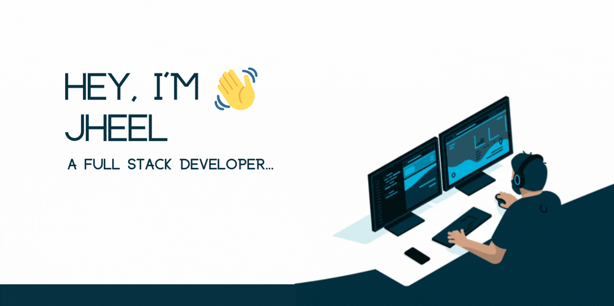

<h1 align="center">Hi , I'm Jheel Soni</h1>
<h3 align="center">A zealous Full Stack Developer and a Tech enthusiast from India.</h3>

- 🌱 I’m currently learning **Recommendation Engine and few other tech skills**
 
- 👨‍💻 All of my projects are available at [https://jheel05.github.io/Soni-Jheel/](https://jheel05.github.io/Soni-Jheel/)

- 💬 Ask me anything about my domain, **🤝 ready to help : )**

- 📫 How to reach me: email: **jheelsoni05@gmail.com**

- 📄 Know about my experiences [https://www.linkedin.com/in/jheel-soni/](https://www.linkedin.com/in/jheel-soni/)

- ⚡ Other Side **I love writing poetries and exploring world:)**

<h3 align="left">Connect with me:</h3>

<h3 align="left">Languages and Tools:</h3>

    <a href="https://developer.mozilla.org/en-US/docs/Web/JavaScript" target="_blank">    <a href="https://www.adobe.com/in/products/illustrator.html" target="_blank">  </a>  </a>  <a href="https://sass-lang.com" target="_blank" rel="noreferrer">        

<h3>Tools and Platform:</h3>

 

 
 

 <h3 align="left">Github Stats:</h3>
 

  
<b><samp>📈 My GitHub Stats(Click)</samp></b>

 

 
 

  

 
 
 

